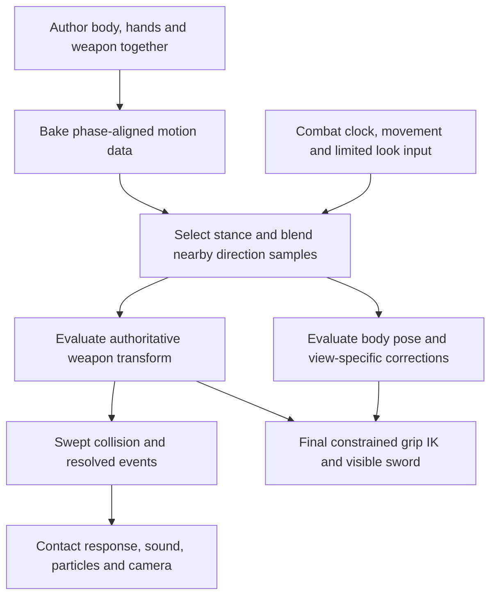

> Archived 7 September 2026. Historical evidence and instructions; use [the current development plan](../../../DEVELOPMENT.md) for active work.

# Animation architecture audit — 7 September 2026

The simulation/presentation boundary is a sound foundation for this game. The motion-authoring layer is still a prototype. My recommendation is a small authored motion library, expanded procedurally into a continuous directional space, with the simulation retaining authority over weapon geometry and attack timing.

240 selectable directions are feasible as samples of that space. They do not require 240 independent animation clips. Production-quality poses, transitions, rigging, and first-person composition still require deliberate authoring.

**Evidence and scope**

This was a code audit and design investigation, not an animation implementation. Existing gameplay source, configuration, and assets were left untouched by this audit. Diagnostic code and a source snapshot are under `Saved/AnimationAudit`.

Other work changed the source during inspection. Conclusions and reproducible diagnostics below refer to the captured source in [SourceSnapshot](../../../../Saved/AnimationAudit/SourceSnapshot), identified by [SHA-256 hashes](../../../../Saved/AnimationAudit/source-hashes.json), rather than asserting that the live checkout remains identical. The snapshot includes the new asymmetric horizontal/overhead `strikeGrip` curves. Earlier in the audit, all strikes used the same rotated grip arc; that earlier characterization no longer describes the entire captured implementation.

I also inspected the saved HandAnatomy first-person and external pose sheets. Their mesh hashes match the inspected assets, but their trajectory/presentation source hashes differ from the current work. They show historical composition/anatomy problems and useful acceptance targets; they do not establish the latest runtime appearance. No fresh Unreal capture, audiovisual playback, or hands-on feel assessment was performed.

**Findings, ordered by impact**

1. **Continuous direction support has actual discontinuities.** The input resolver still rounds to 60-degree sectors. More significantly, `AttackTrajectory::body` chooses body side using the sign of cosine and changes grip roll accordingly. Across +90 and -90 degrees, infinitesimally different directions select substantially different torso and weapon frames. Recovery also selects a side this way. The captured `strikeGrip` switches from the new horizontal/overhead paths to the old underhand formula at zero vertical component, introducing additional boundaries around horizontal directions. These are release-blocking issues for a 240-direction feature, although six-sector input hides them today. See [direction resolver](../../../../Saved/AnimationAudit/SourceSnapshot/Combat/Attacks/AttackDirectionResolver.h), [trajectory](../../../../Saved/AnimationAudit/SourceSnapshot/Combat/Attacks/AttackTrajectory.h), and [probe](../../../../Saved/AnimationAudit/DirectionProbe.cpp).

   A continuous blade angle is insufficient: the hilt, full weapon orientation, body pose, and transition choice must also behave sensibly between neighboring directions. An angle is currently doubling as a stance/handedness selector. Make those separate concepts. At exact overhead/underhand, choose a stable stance or authored bridging pose; preserve handedness and the two-hand chain. Do not blindly average physically incompatible left/right poses. Combo alternation currently mirrors the requested angle via `180-angle`; explicitly define how the alternation rule works at vertical cuts, where that mirror does not establish a distinct body side.

2. **Reach correction is part of the attack shape, not just a visual repair.** `AttackTrajectory::world` projects the hilt into two 43 cm reach spheres before collision. The rig then separately shifts shoulders by up to 6 cm and solves the wrists/elbows. Thus an intended path may be substantially changed while the rendered sword still reports zero endpoint error. That agreement is valuable, but it does not establish that the original motion survived. See [world projection](../../../../Saved/AnimationAudit/SourceSnapshot/Combat/Attacks/AttackTrajectory.h) and [skeletal solve](../../../../Saved/AnimationAudit/SourceSnapshot/Visual/KnightPresentation.cpp).

   Author the weapon and body together against the real skeleton. Use the existing projection as an explicit last-resort constraint, and measure its magnitude and derivative after all adaptation. Reject bad source poses rather than relying on ever-larger compensations. The captured low-level arm solver still has a stretch fallback; fixed bone scale alone does not prove anatomically valid joint placement or connected surfaces.

3. **The body has limited capacity to express a powerful kinetic sequence.** There is already a body lead relative to the blade, plus directional shoulder motion, recoil, and improved hand trajectories. However, pelvis and spine yaw are fixed fractions of a shared chest-yaw channel; feet primarily follow a distance-driven gait and capsule-relative IK. This cannot independently author hip initiation, chest lag, shoulder acceleration, hand passage, wrist release, and recovery. See [body channels](../../../../Saved/AnimationAudit/SourceSnapshot/Combat/Attacks/AttackTrajectory.h) and [pelvis/spine/leg posing](../../../../Saved/AnimationAudit/SourceSnapshot/Visual/KnightPresentation.cpp).

   More rotation amplitude will exaggerate the existing coordination. Add independently timed body channels or an authored skeletal base pose to change the coordination itself. Attack-specific bracing, stance, and support-foot intent should coexist with responsive player-controlled movement.

4. **The weapon representation omits a degree of freedom needed for animation authoring.** `LocalPose` contains a hilt and blade direction. Roll is reconstructed later from `BodyMotion::gripRoll` in the presentation adapter. The round blade sweeps intentionally do not need edge alignment for damage, so this is not presently a collision bug. It is an architectural limitation for authoring wrist orientation, cutting-edge alignment, crossguard clearance, and regrips. See [local pose](../../../../Saved/AnimationAudit/SourceSnapshot/Combat/Attacks/AttackTrajectory.h) and [weapon frame](../../../../Saved/AnimationAudit/SourceSnapshot/Visual/MeleePresentationPose.h).

   Store a complete weapon transform in the motion data, with calibrated grip transforms and continuous orientation interpolation. Collision may continue to derive its existing round sweeps from that transform. Keep the same source data for the visible sword and both hand targets.

5. **The acceptance suite can pass while important visual defects remain.** The presentation tests predominantly sample six attack angles. Their edge-continuity loop varies blade travel in one plane with neutral body roll; it does not test neighboring input angles with attack-derived grip roll. Hand visibility checks test projected points, not arm surface occlusion or opponent visibility. Adapter reach, finite IK, orthonormal frames, and zero blade error are useful contracts with narrower meanings than animation quality. See [presentation tests](../../../../Saved/AnimationAudit/PresentationTests.cpp).

   Add angular seam coverage, full-frame orientation, actual skinned joint/surface inspection, self-intersection and camera-clearance checks, and human judgment at normal speed. Report scenarios and defects, not only the number of repeated assertions.

**What is worth preserving**

The fixed-step combat simulation, explicit windup/release/recovery state machine, spatial mouse manipulation, adaptive blade sweeps, and exact rendered blade endpoints suit the core interaction. Preserve defense ordering, legal inputs, and attack-clock semantics during animation experiments.

The current motion is already more developed than linear interpolation: release speed is shaped, phase boundaries use Hermite tangents, combos capture prior local velocity, recovery carries past release, and contact produces directional responses. The inspected defaults are 575/500/675 ms for strike windup/release/recovery and 700 ms combo windup. Initial experiments should retain these clocks so a better pose is not confused with a faster attack.

Feedback is also present: spatial sound banks, moving swing emitters, result-specific contacts, body shock, directional camera response, and particles. Quality work should build on these. `CombatEvent` currently carries tip velocity and a clamped tip-speed strength proxy, not physical energy or velocity at the actual contact location. If differentiated resistance is needed, derive contact-point relative velocity and contact context; do not treat the existing scalar as measured impact energy. The 65 ms hit pulse changes authoritative geometry while preserving the clock, so changes to it require contact-envelope testing, including multiple targets.

**Recommended architecture**

The authoring unit should be a complete action: load, launch, passage through the strike zone, follow-through, and return or transfer. Store phase markers, full weapon transform curves, body pose/curves, grip offsets, stance/support-foot intent, and limits on directional adaptation. Keep event responses and transition rules alongside this data. Snapshot the selected motion definition at attack start so editing assets cannot alter an active action unexpectedly.

Authoring can use Blender or Unreal Control Rig/Sequencer. The baked weapon evaluator remains accessible to the engine-independent combat code; the skeleton samples the corresponding motion phase. This is a recommended project-specific data pipeline, not a claim that Unreal automatically exports your combat curves. [Epic documents Control Rig animation in Sequencer and Animation Blueprints](https://dev.epicgames.com/documentation/en-us/unreal-engine/animating-with-control-rig-in-unreal-engine).

Use constrained IK to make small final adaptations for grip, view, and movement. Full Body IK provides preferred angles, per-bone limits, and stiffness, but is a procedural adjustment tool; it does not supply the performance. Benchmark it against the existing arm solver before adopting it across all characters. Perform skeletal transition smoothing before final grip IK, so smoothing cannot pull hands away from the authoritative weapon. [Epic FBIK documentation](https://dev.epicgames.com/documentation/en-us/unreal-engine/control-rig-full-body-ik-in-unreal-engine), [inertial blending documentation](https://dev.epicgames.com/documentation/unreal-engine/animation-blueprint-blend-nodes-in-unreal-engine?lang=en-US).

First person and the opponent view need separate composition passes sharing the same attack phase, weapon, and contact events. First person should visibly show hand travel while keeping enough of the opponent visible to steer and judge distance. The opponent view needs distinctive loading silhouettes and clear commitment. The camera's central sightline is an authoring constraint, alongside reach and floor clearance.

**How 240 directions should work**

Assuming 240 evenly spaced selections around a full circle, input spacing is 1.5 degrees. This is unrelated to the existing 240 Hz simulation rate. Start with an estimated 6–8 authored cut anchors plus 1–2 stab variants per weapon/grip style. This is a prototype scope estimate, not an established minimum. Include deliberate vertical solutions; more samples may be necessary around anatomical boundaries.

Blend only nearby, compatible motion samples after aligning their load/release/pass-through markers. Preserve motion amplitude and a coherent cutting plane; averaging unrelated clips can cancel the intended movement. Interpolate orientation with proper quaternion/angle continuity. Represent stance and grip configuration separately from attack angle, and latch the chosen action at the input event. Mouse steering during release continues to transform the trajectory under the existing turn limits.

The runtime evaluates one attack sample at a time, not 240 simultaneous animations. Source coverage and validation are the large costs. Keep the combat evaluator inexpensive at 240 Hz; evaluate skeletal presentation at the appropriate render/update rate. Neighboring 1.5-degree inputs need sensible continuity, not 240 visually distinguishable tells. Defenders should read broad origin, trajectory, commitment, and outcome.

Build transitions by motion family and compatible stance, with procedural transfer from the captured pose and velocity. Avoid a 240-by-240 authored combo matrix. Feint, morph, parry, chamber, riposte, hit, miss, and interruption still require authored intent even where a shared transition evaluator supplies interpolation.

**Options and scope decision**

| Approach | Likely result for this project | Decision |
|---|---|---|
| Continue expanding procedural formulas | Cheap directional coverage; difficult to art-direct anatomy, transitions, and screen composition as special cases accumulate | Keep as the baseline and fallback evaluator |
| Authored motion families plus constrained procedural adaptation | Expressive poses with continuous directional control; requires authoring tools, data baking, and seam validation | Recommended |
| Bespoke clips with discrete attack choices | Most direct path to a polished small vocabulary; sacrifices continuous originating direction if no adaptation is built | Sensible reduced scope if the hybrid fails its quality gate |
| Physics-driven weapon/body as primary attack generator | Adds tuning and control problems; believable forces do not guarantee readable silhouettes or reliable chosen timing | Use physics selectively for secondary response |
| Motion matching or target-oriented root-motion warping as the first rewrite | Does not resolve the missing source performances and constrained two-hand attack space | Defer |

Epic's Motion Warping adjusts root motion to targets. That is useful for other interactions, but it is not the core solution to free directional cuts with player-controlled spacing. [Motion Warping documentation](https://dev.epicgames.com/documentation/en-us/unreal-engine/motion-warping-in-unreal-engine).

**Methodology for violence, power, and readability**

Design contrast and consequence. A loaded pose should oppose the eventual cut and visibly store effort. The body begins the action, the hands carry it, and the blade accelerates through a deliberate strike zone. An empty swing must continue past the target line; the recovery has to deal with that commitment. Contact introduces visible resistance or redirection, a recipient response, and synchronized sound. Exaggerate those relationships within believable joint limits.

Avoid treating a long windup, a larger arc, or a faster blade as independent quality upgrades. Anticipation has a gameplay job: it lets an opponent understand and respond. Arkane's first-person melee presentation explicitly discusses having to revise anticipation because players lacked time to react. [Raphael Colantonio's GDC slides](https://media.gdcvault.com/gdc07/slides/S3736i1.pdf).

The first useful experiment is two excellent horizontal cuts and one overhead, each tested as a miss, body hit, parry, and riposte, then a short combo. Compare the snapshot baseline against an authored version at matching clocks, FOV, weapon reach, targets, and audio. First judge the motion with restrained effects; then compare the full synchronized feedback. Keep attacks interruptible exactly when the rules allow, even if a cosmetic return is unfinished.

Use randomized A/B order and ask players to rate power, control, and clarity separately. In opponent view, remove debug labels and ask what direction the attack comes from, when it becomes committed, and why it hit, missed, or was defended. Compare close, middle, and reach-edge distances; moving attacks, accels/drags, extreme pitch, crouch, wall contact, and transitions. Inspect slow motion to diagnose defects and normal speed to judge the performance.

Then build a narrow interpolated fan around overhead and verify it across the left/right boundary before expanding to all 240 directions. Measure hilt/tip and orientation changes between neighbors, phase-boundary velocity, correction magnitude, grip error, and camera occlusion. Add broad 240-direction contact coverage and focused transition cases rather than prematurely testing every possible pairing. Keep current defense, input, and frame-rate tests, and profile representative combat at the target frame budget.

If excellent anchor motions cannot adapt across that fan without large corrections, broken silhouettes, or loss of control, add anchors or reduce the angular range of each family. If the cost remains unacceptable, ship 6–8 excellent authored directions and retain spatial swing manipulation. That is the explicit fallback. There is no evidence here that 240 directions require 240 bespoke clips, and no evidence that unassisted formulas will automatically reach the desired quality.

**Diagnostic results**

The isolated snapshot compiled with MSVC C++20, `/W4 /WX /O2` and passed 605 combat checks, 1,080 swing checks, and 1,413,854 presentation assertions. These runs did not use AddressSanitizer. The large presentation count includes repeated assertions over sampled frames; it is not a count of distinct visual scenarios. [Runner](../../../../Saved/AnimationAudit/RunSnapshotTests.ps1), [combat output](../../../../Saved/AnimationAudit/CombatTests-results.txt), [swing output](../../../../Saved/AnimationAudit/SwingTests-results.txt), [presentation output](../../../../Saved/AnimationAudit/PresentationTests-results.txt).

The separate probe evaluates neutral standing release poses directly, with ordinary strikes and the built-in defaults. It compares independently selected directions at equal release progress; these measurements are not per-frame jumps during a fixed-angle attack. It does not include live input, collision events, or rendered skeletal surfaces. [Probe runner](../../../../Saved/AnimationAudit/RunProbe.ps1), [full measurements](../../../../Saved/AnimationAudit/direction-results.txt).

| Check | Measured result | Meaning |
|---|---|---|
| 89.999 vs 90.001 degrees at release start | 38.72 degrees chest-yaw difference; 166.00 degrees weapon-edge difference; 7.00 cm world-hilt difference | Body/roll side selection breaks directional continuity despite nearly identical local blade axes |
| Same pair at release end | 52.80 degrees chest-yaw difference | The discontinuity persists through the action |
| -0.001 vs +0.001 degrees at release start | 9.89 cm hilt difference | The captured new horizontal path does not join the preserved underhand path |
| 179.999 vs 180.001 degrees at release end | 12.39 cm hilt difference | The opposite horizontal boundary also needs an authored blend |
| 240 angles, 101 release samples each | Maximum neighboring hilt difference 13.07 cm | 1.5-degree input spacing does not presently imply a smoothly varying motion space |
| Same neutral standing grid | Maximum reach projection 13.03 cm, at 270 degrees and p=0.93 | Correction can materially change the authored path |

The grid values are sampled maxima, not global bounds. The blade's symmetric appearance may mask some edge-frame rotation, but the same orientation is used to construct asymmetric hand and crossguard presentation, so frame continuity still matters. The snapshot passed its six-direction contracts while this probe exposed missing directional-space coverage.
