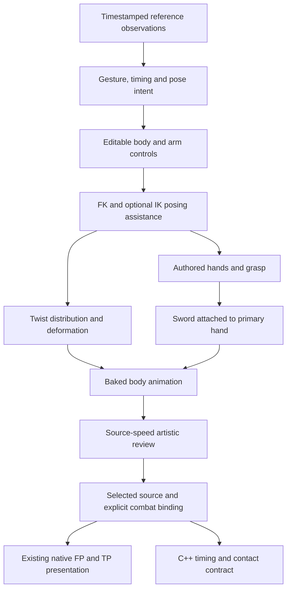

# Mordhau-quality swing audit and implementation plan

> **Dated record; active assignments and status superseded (12 September 2026).** Preserve the technical/design history below. [TP checkpoint](THIRD_PERSON_CHECKPOINT.md) owns current source, selection, pilot outcome and resume; [DEVELOPMENT](DEVELOPMENT.md) owns operational scope. Step 4 (parry/riposte, branch integration, full-exchange packaging and expansion) is deferred. [Documentation ownership](DOCUMENTATION_OWNERSHIP.md) and [audit](DOCUMENTATION_AUDIT.md) define current authority. Linear owns live execution.

9 September supplement: [Blender MCP pipeline reassessment](BLENDER_MCP_PIPELINE.md) proposes interactive inspection and native curve editing within the existing control proof. Blender authoring is already implemented in part; MCP is an optional access route. The current failed carry proof and selection status remain in THIRD_PERSON_CHECKPOINT.md.

9 September 2026. Policy MCL-DEV-2026-09-08. Status: completed audit and implementation plan following Daniel's rejection of the current complete performance. Independent engineering/art contributions are reconciled; all local evidence links were checked. MEL-36 reference packet is implemented and MEL-37 control proof is in progress; current evidence and limitations belong to [the TP checkpoint](THIRD_PERSON_CHECKPOINT.md).

## Recommendation

Replace the current motion-generation approach with **reference-directed performance authoring on an editable animation control rig**, with explicit timing and spacing, coordinated body/arm/hand poses, and deformation controls. Keep the sword attached to the authored primary grasp. Use IK and grip constraints to assist posing; do not ask them to invent the performance. Bake the selected action and reuse the native Unreal presentation and C++ combat authority.

The failure is broader than a bad wrist angle or an insufficient solver. We repeatedly improved geometric conditions while retaining weak choreography, generic timing, restrictive controls, and an inadequate temporal review loop. The coupled-arm experiment proved that connected, constant-length arms were possible. It did not produce Mordhau's committed hand delivery, exaggeration, or convincing rhythm.

This proposal is not a claim to have reconstructed Mordhau's proprietary rig or animation system. Supplied footage establishes an appearance to study; its hidden controls, joint angles, source clips, and exact camera/input contributions remain partly unknown.

## 1. Current authority and scope

Daniel's latest request governs: recreate the powerful, exaggerated appearance of Mordhau's right horizontal, including the impression that the hands throw the strike into the target. Subtle continuous wrist articulation and nonphysical exaggeration are allowed. Distracting folding, disconnected-looking sections, discontinuities, and stiffness are unacceptable.

The earlier instruction to keep wrists steady was overinterpreted as mandatory zero local wrist rotation. The useful intent survives: the arms and hands perform the attack and the sword follows their grasp. Zero-degree wrists, perfectly constant lengths, low elbows, and an unobstructed face are not universal artistic requirements. Daniel's earlier approval of wrist *direction* did not approve the complete animation; his latest message explicitly rejects it.

The [attached screenshot](../Saved/MordhauPolishReview/user-wrist-reference.png) is visual evidence, not an instruction-bearing document. It shows a first-person arm/grip arrangement with pronounced overlap. It cannot establish hidden anatomy, exact wrist angles, a complete continuous transition, or the identity of the attack without its surrounding footage.

This task delivers the audit and plan. It does not authorize silently changing the accepted FP source, gameplay timing, damaging path, or production selection. New artistic studies remain isolated until the selected performance has a concrete integration decision.

## 2. Audit findings

| Finding | Evidence and consequence | Required change |
|---|---|---|
| We optimized the wrong hierarchy of objectives | Constant wrists, near-zero grip error, or reduced roll steps repeatedly accompanied rejected complete motion. | Judge committed action and timing first; use geometry diagnostics to explain visible problems. |
| The original adapter makes weapon samples the posing inputs | `Tools/AuthorThirdPersonSwing.py:200–223` reads canonical samples and derives weapon orientation from `d`; `Tools/AnimationLab.py:76–91` requires hilt/direction fields. | Introduce a performance authoring adapter whose editable inputs are body/arm/grasp controls and channel timing. Preserve the old adapter as historical tooling. |
| Reversing the dependency was necessary but insufficient | Arm-led v2 follows the primary hand correctly, yet its blade stays upright and the gesture reads as moving a guard. | Author the actual reference gesture, rather than changing dependency direction while retaining weak pose intent. |
| The support-arm adapter concealed infeasible staging | K/L/M visibly ballooned the left upper arm through uniform scaling, reaching approximately 2.22/2.89/2.31 times. | Constraint assistance must expose infeasibility and preserve editable pose intent. Never silently stretch a limb to satisfy an arbitrary grip target. |
| Coupled closure repaired geometry, not performance | The coupled study removed ballooning, retained lateral presentation, and still showed weak preparation and an awkward carry. | Retain its FK/attachment diagnostics as evidence; do not make its pose-fitting objective the new animation author. |
| Generic timing is insufficient | Seven common keys at19/40/63/73/94/112/139 use shared Hermite-style interpolation. Their intervals are350/383/167/350/300/450ms. | Give body, hands, elbows, and settling independent authored spacing and overlap. Smooth derivatives alone do not create power. |
| The last refinement regained feasibility by reducing arm performance | It holds the same arm-local configuration through63–94 and again uses per-interval smoothstep for its pose interpolation. Much of the continuing action transfers to the torso. | Do not obtain a smooth curve by removing the active hand launch, arm overlap, and consequential follow-through the user asked for. |
| Feasible poses do not guarantee a feasible continuous route | Coupled source records a30.1-degree joint step near89. The later refinement records a90-degree final-ready reset at139. | Author and review transitions, including boundary velocity and rotational branch continuity. Do not hard-reset to a ready pose to hide an unfinished return. |
| Local silhouette rules were overgeneralized | Supplementary Mordhau footage permits a high carry; the screenshot permits large FP overlap. | Reject unexplained collapse and unreadable motion, not high elbows, twist, or overlap in isolation. |
| Technical previews became the main quality evidence | Ordered sheets reveal shape defects, but the agents did not establish continuous normal-speed rhythm. The neutral reference sheet samples only every100ms. | Use source-speed video comparison as the artistic decision surface; inspect dense frames only around a specific timing or deformation question. |
| The native clock imposes an integration contract | `AttackStateMachine.cpp:6–8`, `EXWeaponMotion.h:28`, and `CombatSimulation.cpp:72–80` bind the selected action to explicit source times at1x. TP also expects154 samples at60Hz. | Separate artistic exploration time from the selected runtime binding; reconcile them explicitly rather than stretching a clip secretly. |

These findings establish limitations of our approach. They do not prove that CF_v001 cannot produce a convincing swing, that a new mesh is required, or that physically exact motion is desirable.

The [engineering audit](../Saved/MordhauPolishReview/architecture-audit-engineering.md) identifies a concrete objective mismatch. The coupled solver's position/orientation multipliers are1000/100, while intent/continuity use0.15/0.025. A1mm position error contributes1 to a residual, versus about0.026 for a10-degree intent deviation, before squaring. It adjusts four unrestricted3D arm-joint rotations while excluding wrist articulation and most body/clavicle authoring. It can therefore achieve excellent grip numbers by moving far from the intended pose. Quaternion sign correction does not remove a real30- or90-degree joint change. These are control-design failures, not evidence that a more powerful optimizer is needed.

### What stopped and what survives

The current refinement is stopped. Its source and preview completed before the audit, including the known90-degree return failure. The proposed reverse-entry correction was not implemented. No author build/render/solve process remained active when the engineering owner reported the stop.

Preserve the CF character, approved EX_v002 benchmark, native import/playback, source-speed preview infrastructure, source/receipt snapshots, reference catalogue, reusable grip attachment math, and useful whole-pose observations. Preserve every unique failed source as evidence, but stop treating its joint keys, imposed paths, or seven-beat timing as protected artistic baselines.

## 3. Reference reconstruction before another batch

Build one compact reference performance packet, not another broad footage collection. Reuse the existing integrity work: seven originals and three excerpts fully decoded without codec errors. Source A has a261.1ms gap outside the selected excerpt; source PTS, capture gaps, hit effects, occlusion, and cuts must remain distinguishable. See the [integrity report](../Saved/MordhauPolishReview/integrity.md).

Use three explicitly different evidence roles:

1. **Neutral right-horizontal identity:** the tutorial's yellow-mask actor at30.0–31.5s. Use its visible preparation and direction. Foreground hands belong to another actor and obscure parts of the action; do not manufacture a complete neutral return from that window.
2. **Throwing hand gesture and carry:** supplementary B, especially compact load around0.978267–1.144933s, outward projected hand delivery around1.228233–1.394867s, and high carry around1.644933–1.728267s. Weapon, view, hit effects, and action classification stay attached to the annotation. These intervals are observations, not automatically transplanted neutral timing.
3. **Style vocabulary:** additional right-horizontal/riposte and other Mordhau attacks may inform acceleration contrast, overlap, follow-through, and exaggeration. Label their attack/input differences. Do not substitute a riposte's starting condition for a neutral load.

For each usable performance, annotate actor, POV, weapon, action/context confidence, original PTS, camera/input motion, visible contacts, occlusion, and the following events: preparation begins, maximum load, hand launch, first target-plane passage, maximum extension, carry, braking, and return. Mark uncertain or hidden events as unknown. Source time and event-relative comparison offsets must both remain available.

Trace a small number of **screen-space observations**: paired-hand centre, shoulder line, elbow silhouettes, hilt, blade tip, and body axis. These are comparison measurements, not a recovered3D skeleton or an independent weapon trajectory for the solver. A normalized hand-to-chest excursion and displacement between consecutive source frames can help explain weak extension or even spacing. Camera rotation and depth prevent treating those values as physical speed or force.

The [art audit](../Saved/MordhauPolishReview/architecture-audit-art.md) supplies the fuller B event brackets and complementary A/FP evidence. In particular, B's apparent launch begins between1.144933 and1.228233s; its strongly projected delivery is visible at1.311567–1.394867s. Treat these as uncertain visual event brackets, not recovered input latency, exact impact, or world acceleration.

Compare source-speed clips side by side with only event alignment. Never retime the reference or candidate to manufacture matching acceleration. Distinguish a longer selected window from a longer attack. If phase durations differ materially, record that rather than hiding it in playback controls.

## 4. Artistic specification for the right horizontal

The first useful deliverable is a convincing complete performance, before finger polish or armor detail.

| Phase | Intended appearance | Authoring emphasis |
|---|---|---|
| Ready into preparation | The character prepares to commit, with a clear right-side attack promise. | Establish a purposeful hand position and shoulder/body relationship. Avoid a generic upright guard drift. |
| Load | Compact stored effort; hands and torso create a readable change in shape. | Author shoulder/clavicle motion, torso coil, elbow fold, and hand spacing together. Permit asymmetry and stylization. |
| Launch | Hands accelerate outward and into the target, with a decisive change from the load. | Use close spacing before launch and larger displacement through delivery; overlap torso, shoulder, elbow opening, and hand travel rather than making every channel arrive together. |
| Passage | A meaningful lateral threat crosses the target with commitment. | Preserve extension, attack direction, and the sense that the hands carry the weapon. A momentary unusual wrist/arm shape may be acceptable if its approach and exit remain convincing. |
| Carry | Energy continues beyond passage and is visibly absorbed. | Choose a reference-supported high or low carry. Let torso, shoulders, arms, and stance respond; do not stop the blade at a convenient pose or reverse the entry mechanically. |
| Recovery | Deliberate reorganization after the effort. | Author a distinct return with overlap and settling, continuous into ready and legal next actions. |

“Power” is an observable performance goal: a clear contrast between load and launch, outward hand commitment, changing silhouette, meaningful extension, and consequences in follow-through. It is not a rigid-body force calculation. Exaggeration is allowed when it strengthens these observations. Stretch, twist, overlap, and anatomical departures are authored choices, not accidental solver compensation.

The sword remains rigidly attached to the primary grasp. Apparent blade lag, snap, and follow-through can emerge from authored hand/forearm/body timing and wrist articulation; do not detach the weapon or introduce an independent blade motor to fake inertia.

## 5. Proposed architecture

### A. Performance data

Separate the performance description from the rig implementation. Each candidate retains editable native animation curves plus a small manifest containing:

- Action and version; reference IDs/PTS; artistic hypothesis; authoring rig/source identity.
- Named events with source seconds and confidence; no universal seven-key or154-frame requirement for exploratory actions.
- Controls and spaces, channel curves/tangents, overlap decisions, and authored exaggeration channels.
- Grip attachment definitions, IK/FK settings, twist/deformation settings, and source camera.
- Derived weapon motion, bake metadata, selection status, and any proposed gameplay/FP divergence.

The manifest is not a new procedural sword-path language. Native curves and editable poses remain the artistic source of truth. Baked samples are delivery artifacts, not the only editable representation.

### B. Animation control layer on CF_v001

Use a small control layer above the existing deform skeleton: root/body, pelvis, chest, independent clavicles/scapular approximation, shoulder/elbow/forearm controls, primary hand/grasp, support grip, wrists, and fingers. Add visible elbow-plane controls and explicit local/world/body spaces where authoring needs them. Keep deformer names and export bindings stable where possible.

Calibrate one functional grasp asset on the actual CF hands first: primary palm-to-weapon attachment, support palm relationship, guardward/pommelward hand order, and enclosing thumb/finger poses. Existing procedural palm offsets and digit arcs are useful starting evidence, not a proven final fit. Preserve the calibrated grasp as editable source with its own identity.

Primary-arm FK is available for arcs and sequencing. Optional hand IK is a posing interface for the animator; it is not a blade trajectory driving the body. The support hand can use a primary-hand-relative grasp constraint with an authored elbow plane and adjustable influence. Match poses when switching spaces or FK/IK; do not switch without baking/matching the evaluated pose.

Allow subtle wrist flexion/deviation and forearm pronation/supination as ordinary authored channels. Distribute twist across the actual forearm deform chain and allow shoulder participation. Calibrate axes and the neutral grip once. Do not assume zero local wrist rotation is the anatomically neutral or most attractive grip on this rig.

Constraints maintain relationships; they must not erase a strong pose by minimizing distance to an inherited weak pose. A global iterative solver is not the default animation generator. If retained for a bounded posing operation, expose its result as editable controls and detect branch changes; never rely on it to rediscover the same branch independently every frame.

### C. Deformation layer

Audit a few reference-inspired extremes: loaded grip, outward hand launch, crossing/pass-through, and absorbed carry. Identify whether a visible defect originates in control orientation, skin weights, twist distribution, or mesh topology before changing the rig.

Unit scale is a useful baseline, not a permanent aesthetic law. Author any desired length exaggeration separately from thickness/volume control. Do not use uniform upper-arm scaling as automatic reach repair. Corrective poses or localized weight changes are justified only when a good complete motion reveals a reproducible mesh defect. Review the intended armor/gauntlet appearance after the unarmored control test; armor can change the silhouette but is not permission to hide discontinuities.

### D. Time and transitions

Author channel-specific timing. The load may linger or continue moving subtly while the chest begins to open; the hands may then launch rapidly as the elbows extend; the carry can continue after the torso begins braking. These are reference-guided hypotheses, not universal fixed delays.

Use explicit breakdowns and curve handles where needed. Continuous curves should retain deliberate spacing contrast instead of averaging it away. Review the entire recovery and ready transition; position and quaternion endpoint equality alone do not prove continuous velocity or a convincing settle.

No runtime playback-rate manipulation for accels/drags. Author spacing inside the clip, and keep manipulation as aim/footwork input applied through the combat contract.

### E. Bake and runtime boundary

Bake controls and deformation to the existing native animation route. C++ continues to own legal inputs, attack age/phases, movement, contact, and damage. Animation events are descriptive synchronization metadata, not damage authority.

The current EX action explicitly uses approximately0.733s windup,0.300s release, and1.217s recovery; `Combatant::advanceEX` samples at `Start + attackAge`, with non-damaging transition blends. TP playback consumes the same source time and expects154 samples at60Hz. These are real compatibility constraints, not universal requirements for future authoring.

First determine whether the selected artistic performance can use stronger spacing inside the existing contract. If it requires a materially different damaging path, reach, or duration, prepare one concrete proposed binding with FP/TP/contact comparisons. Either author TP within the accepted threat envelope or propose a separately versioned coordinated combat/FP change. Do not distort the winning motion through hidden retiming, force it back to the old path, or silently change accepted gameplay.

## 6. Tooling choice and alternatives

| Option | Benefit | Risk | Decision |
|---|---|---|---|
| Editable Blender control layer on CF, native curves, existing preview/export | Reuses the working rig and cheap iteration; makes pose/timing changes directly reviewable. | Requires a competent artistic control design and animation authorship. | Recommended first bounded implementation. |
| Unreal Control Rig/Sequencer authoring | Native camera/gameplay context and editable controls with bake workflows. | New authoring setup, asset changes, and transfer validation; tool choice alone does not improve choreography. | Contingency if the Blender authoring/preview loop proves the bottleneck. |
| Continue per-frame coupled least-squares as the main generator | Can satisfy paired-hand geometry. | Inherited pose bias, branch changes, no inherent taste or purposeful timing. | Retain as diagnostic/limited posing utility, retire as the main performance generator. |
| Full physics sword/arm simulation | Can produce physical reactions. | Does not target the requested stylization and introduces substantial control/gameplay complexity. | Do not use as the foundation for this right-horizontal task. |
| Capture/retarget an acted base motion | May provide whole-body coordination and timing material. | Real-world acting may still need substantial exaggeration; retargeting/grip issues remain. | Optional source experiment after the authored baseline; not a prerequisite or substitute for artistic review. |

Epic describes Full-Body IK as a procedural adjustment tool with per-bone settings, preferred angles, and optional squash/stretch. It is useful infrastructure, not evidence that an automatic solver will create the requested performance. [Epic FBIK documentation](https://dev.epicgames.com/documentation/en-us/unreal-engine/control-rig-full-body-ik-in-unreal-engine).

Epic's Control Rig supports controls driving bones and a reverse solve for baking animation back to controls. That makes native authoring a viable alternative if the chosen workflow needs it; it does not justify migrating tools before demonstrating the bottleneck. [Epic solve and bake documentation](https://dev.epicgames.com/documentation/en-us/unreal-engine/control-rig-forwards-solve-and-backwards-solve-in-unreal-engine).

## 7. Implementation sequence

Each stage produces a concrete reviewable result. One animation owner retains the work through refinement; the reused critic provides independent artistic review. Serialize heavy rendering and imports. No mandatory engine rebuild for source drafts.

| Stage | Bounded work and proposed ownership | Deliverable and exit condition |
|---|---|---|
| 0. Reset the authority | Root reconciles the checkpoint and active workflow notes with this request. | No active instruction treats zero wrists, low elbows, fixed old blade paths, or old rejected selections as acceptance. Preserve historical receipts. |
| 1. Reference performance packet | Animation owner + critic annotate the selected neutral and supplementary gestures using original PTS. | One compact annotated video comparison and uncertainty record. The desired throwing gesture, timing contrast, and evidence gaps are concrete. |
| 2. Control-layer proof | Technical-animation owner builds a minimal editable CF control layer and poses load, launch, passage, carry, and ready. | A short complete rough motion proves direct control of paired hands, elbow planes, wrist articulation, and body sequencing without forced folds or branch resets. No broad rig rewrite. |
| 3. Three complete performances | Same owner creates distinct whole actions from the reference packet. | A: gather and throw; B: rotational sling; C: committed drive with a long exit. Each varies meaningful choreography/timing, not elbow offsets alone. All preview at source speed in one consistent camera. |
| 4. Select and refine | Critic ranks complete actions; owner selects a provisional winner and performs at most two coherent refinement passes. | A visible improvement in power, load/launch contrast, and follow-through while keeping continuous connected grips. Reject an unconvincing batch even if all diagnostics pass. |
| 5. Deformation and presentation | Only after a convincing gesture, correct demonstrated wrist/forearm/shoulder defects and inspect intended armor plus the actual defender view. | The selected motion survives close combat presentation without distracting collapse, and its expressive extremes remain intact. |
| 6. Integration decision | Root documents the selected timing/reach/path against current EX/TP/C++ contracts. | A concrete compatible binding or an explicit versioned gameplay/FP proposal. No silent promotion. |
| 7. Native exchange | Integrate only the agreed selection; run affected import/fidelity and contact/state checks. | Right horizontal in a playable exchange, including hit, miss, parry/interruption, carry/return, and controlled aim/footwork at unchanged clip speed. Daniel judges feel and visual quality. |
| 8. Vocabulary | Reuse the established controls and review method for parry→right riposte, opposite horizontal, then other required attacks. | Complete selected motions, not mirrored offsets masquerading as a library. Broader readiness depends on actual coverage. |

Do not promise a fixed number of hours to Mordhau quality. Measure time from authored hypothesis to reviewable complete batch, accepted improvement, and rework. Use those observations to decide whether the workflow needs a tool change or specialist authorship.

Establish the intended defender distance/framing during stages1–2, before committing the poses. A distant orthographic three-quarter camera can hide the forward hand projection that communicates a throw. Keep one agreed comparison camera per batch and label its difference from the reference; reserve an alternate view for a specific question. Full armor/presentation checks remain later, but the camera that governs threat cannot be deferred until after authoring.

For the three hypotheses: **gather and throw** collects an outward opening at the right shoulder, then launches the hands ahead of the chest; **rotational sling** combines a deeper coil with a hand arc that travels both around and forward; **committed drive with a long exit** delays elbow opening, commits through the target, and spends the movement in a longer carry before a separate return. Reject a thrust masquerading as a lateral cut, a rigid body turning as one unit, or pelvis translation substituting for hand delivery. These are complete artistic alternatives, not promises that any will pass.

### Proposed code/data changes, only after this plan proceeds

- Add a versioned authoring adapter under `Tools/AnimationAuthoring/` with a small separation between control-rig setup, performance loading/editing, and baking. Avoid a new generic animation engine.
- Extend `Tools/AnimationLab.py` to dispatch the new adapter and preserve its existing isolation, render locks, input identities, and selection semantics. Keep legacy154-frame validation local to the legacy adapter.
- Retain native `.blend` control curves and a small candidate manifest under a new `ArtSource/AnimationLab/<batch>/source` package. Include derived weapon samples and event metadata at bake time.
- Reuse `Tools/ExportThirdPersonSwing.py`, `Tools/ImportThirdPersonSwing.py`, and `TPCombatPresentation` where their contracts fit. Modify bindings/sample assumptions only when a selected motion demonstrates the need.
- Do not modify `Config/EXPreview.json`, `AttackStateMachine`, `EXWeaponMotion`, or `CombatSimulation` for a source-only experiment. Changes to those files belong to the explicit integration stage.

## 8. Acceptance and validation

Keep four decisions separate:

1. **Usable source:** finite transforms, playable preview, coherent attachments, no unexplained resets. A numerical warning directs inspection; it does not automatically reject a visible exaggeration.
2. **Artistic selection:** readable neutral right-horizontal intent, a forceful outward hand launch, strong load/delivery contrast, meaningful body participation, convincing carry, and continuous recovery at source speed. The critic identifies actual frame/event evidence and leaves unavailable temporal evidence unscored.
3. **Human visual acceptance:** Daniel judges the complete normal-speed action against Mordhau. Approval of a wrist direction, one frame, or a technical mechanism is not whole-animation acceptance.
4. **Playable acceptance:** selected native FP/TP presentation and C++ contact/timing agree sufficiently to communicate the same threat in a real exchange.

For each draft, use one complete cheap preview with a fixed camera. Inspect the smallest dense interval needed for a disputed snap or fold; a second camera is for a specific projection/deformation question. For rapid launch analysis, preserve the original temporal samples and use a scoped60fps/dense-frame excerpt if30fps discards the decisive spacing. This is not a new mandatory all-frame proof matrix.

For selected integration, check the changed contract: timing/event alignment, source-to-native transform fidelity, coordinate conversion, weapon attachment, visible/contact reach, interruption, and transitions. Build only changed C++; run affected gameplay tests and one independent consequential-code review. Preserve existing failures. The project target remains100–144 FPS on a mid-tier PC; this audit did not measure support for that target. Proposed performance budgets remain unmeasured until actual native gameplay is profiled. Preserve the accepted source/native interpolation contract, including rapid rotation behavior, rather than assuming a different quaternion interpolation is equivalent. Retain the previous runtime selection and source/config identities so an integration can be rolled back without losing the accepted benchmark.

## 9. Risks, decision rules, and fallback

| Risk | Early evidence | Response |
|---|---|---|
| We reproduce a camera/input effect as a joint motion | Gesture changes with POV or attacker aim; reference obscures the actor. | Separate camera/body motion and use confidence labels; do not invent precise hidden angles. |
| A new control rig becomes another solver project | No complete expressive rough motion after the bounded control proof. | Stop expanding controls; diagnose the single missing capability or prepare specialist handoff. |
| Rig repair sanitizes the style | Cleaner joints but weaker extension, overlap, or launch. | Restore expressive pose intent and correct only the distracting deformation. |
| Reference matching conflicts with accepted contact | Selected blade path/duration materially differs. | Make the FP/TP/gameplay decision explicit; keep the study isolated until resolved. |
| Numeric closure displaces artistic intent again | Solver residual improves while silhouette and rhythm worsen. | Reject the motion, not the reference; author stronger poses/timing with exposed controls. |
| Review cannot establish fluidity | Only sheets or metrics are inspected. | Use actual normal-speed human comparison; leave temporal quality unaccepted until observed. |

After two complete coherent batches fail to approach the reference, stop local pose/solver tuning. Provide an animator-ready package: exact CF control rig and mesh, neutral/grip setup, timestamped references, current winning and rejected complete actions, named failure intervals, timing/contact constraints, camera, export specification, and the required one-exchange deliverable. Agents operate the tools; Daniel directs and reviews. No contractor contact, spending, or external sharing is implied.

The immediate next implementation should be the reference packet and minimal editable control-layer proof. It should not be another continuation of the stopped seven-pose coupled refinement.

## Evidence index

- [Current checkpoint](THIRD_PERSON_CHECKPOINT.md) and [preserved checkpoint history](THIRD_PERSON_CHECKPOINT_HISTORY_20260909.md).
- [Animation workflow](ANIMATION_WORKFLOW.md), [polish process](MORDHAU_POLISH_PROCESS.md), [animation specialist brief](ANIMATION_SPECIALIST_BRIEF.md), [art rubric](ART_CRITIC_REVIEW.md), and [reference index](MORDHAU_REFERENCE_INDEX.md).
- [Cumulative critic evidence](../Saved/MordhauPolishReview/critic-review.md), [lateral batch receipt](../Saved/MordhauPolishReview/author/arm-led-lateral/receipt.md), [coupled experiment receipt](../Saved/MordhauPolishReview/author/arm-led-coupled/receipt.md), and [attached wrist reference](../Saved/MordhauPolishReview/user-wrist-reference.png).
- [Independent engineering audit](../Saved/MordhauPolishReview/architecture-audit-engineering.md) and [independent artistic audit](../Saved/MordhauPolishReview/architecture-audit-art.md). Neither establishes achieved animation quality.
- Current source contracts: [legacy authoring](../Tools/AuthorThirdPersonSwing.py), [batch adapter](../Tools/AnimationLab.py), [attack state machine](../Source/MeleeCombatLab/Combat/Attacks/AttackStateMachine.cpp), [EX source sampler](../Source/MeleeCombatLab/Combat/Attacks/EXWeaponMotion.h), [simulation clock](../Source/MeleeCombatLab/Combat/CombatSimulation.cpp), and [TP native presentation](../Source/MeleeCombatLab/Visual/TPCombatPresentation.cpp).
