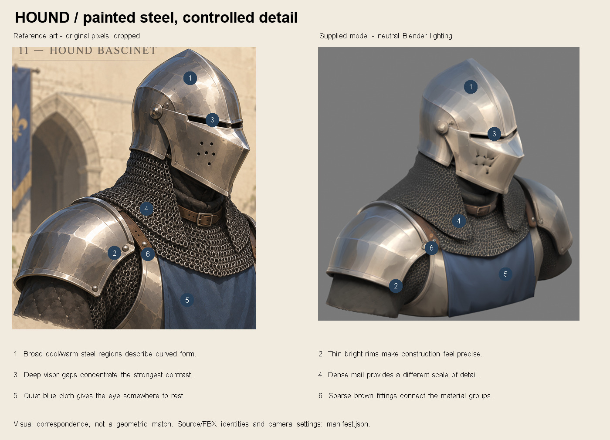
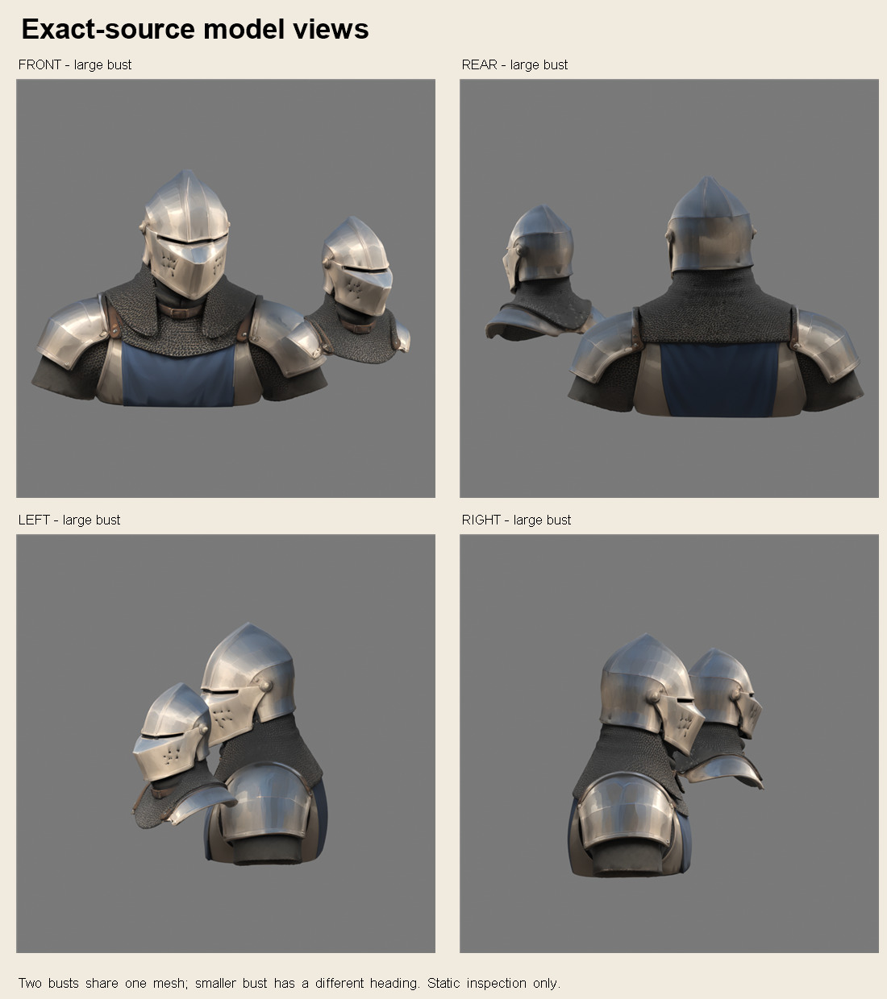
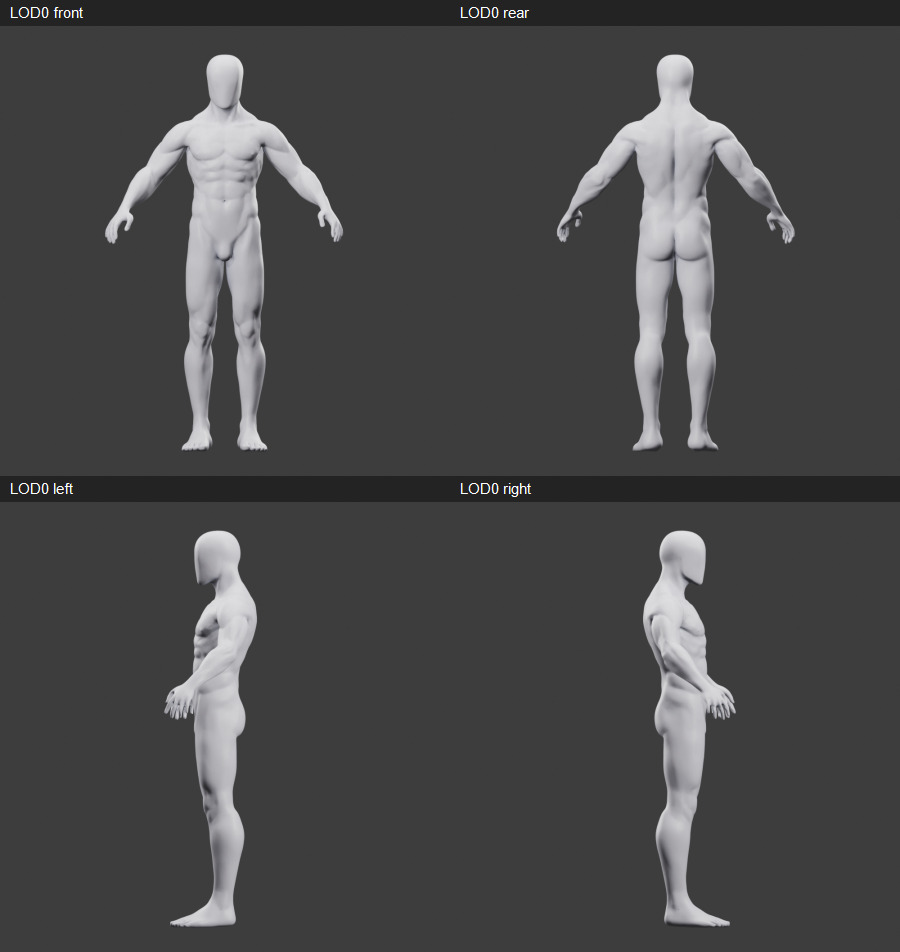
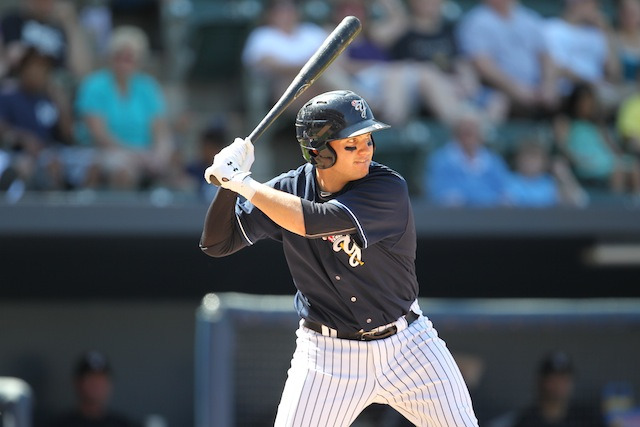
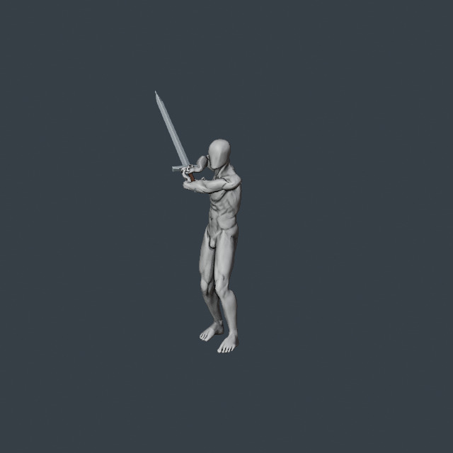
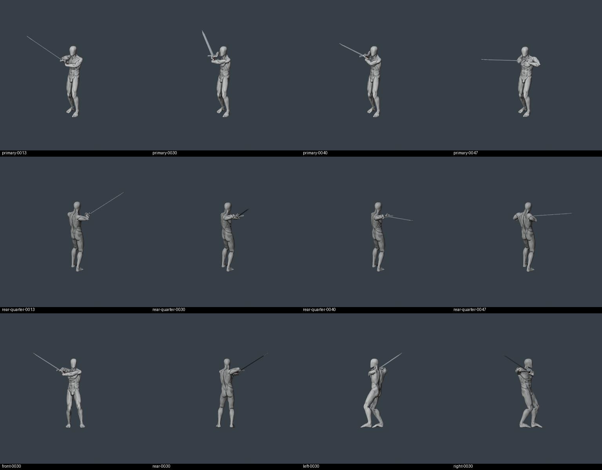
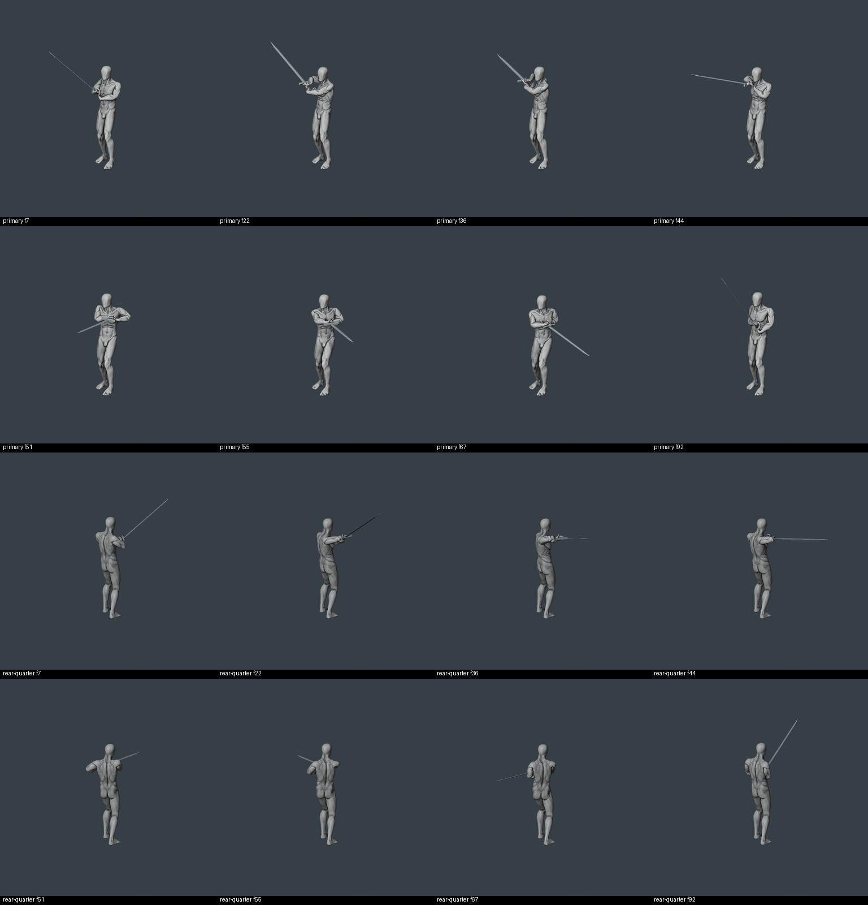

# Art review snapshot — 13 September 2026

Start with [review context](../GITHUB_REVIEW.md). This gallery pairs selected art with its status; the [manifest](manifest.json) binds source identities and image derivatives. Current work remains owned by [the TP checkpoint](../THIRD_PERSON_CHECKPOINT.md) and [development](../DEVELOPMENT.md).

## Surface-style direction

The Hunyuan Hound model is Daniel's selected surface-style anchor. This is an art direction reference, not an integrated runtime character. See the [surface guide](../Visual/HOUND_SURFACE_STYLE_GUIDE.md).

[Supporting concept](hound-concept.jpg) · [Texture channels](hound-channel-atlas.jpg) · [Lighting diagnostics](hound-lighting.jpg) · [Palette](hound-palette.jpg) · [Distance study](hound-distance.jpg)

## Working character

MB_v005_SurfaceRepair is the current AccuRig authoring body. Rest-surface checks and extreme joint-deformation limits are distinct; the [body checkpoint](../../ArtSource/UserMaleBody/MB_v005_SurfaceRepair/CHECKPOINT.md) records the unresolved findings.

## Third-person animation draft

B_ArmLoad_v004 is the provisional lead from three fresh Kimodo proposals and one native elbow refinement. It is unaccepted and not integrated. Windup1.30s; native release0.50s;92 samples at30fps; full1x timing. Fingers, lower-body support and carry remain rough. The source blade path has not been shown compatible with gameplay contact.

[Complete primary movie](animation-primary.mp4) · [Complete rear-quarter movie](animation-rear-quarter.mp4) · [Timing check](animation-timing.json) · [Detailed result](animation-result.json)

These images establish sampled visible facts only. Do not infer continuous rhythm, playable quality or human acceptance from sheets or technical checks. The videos are retained at source speed for explicit motion review.
