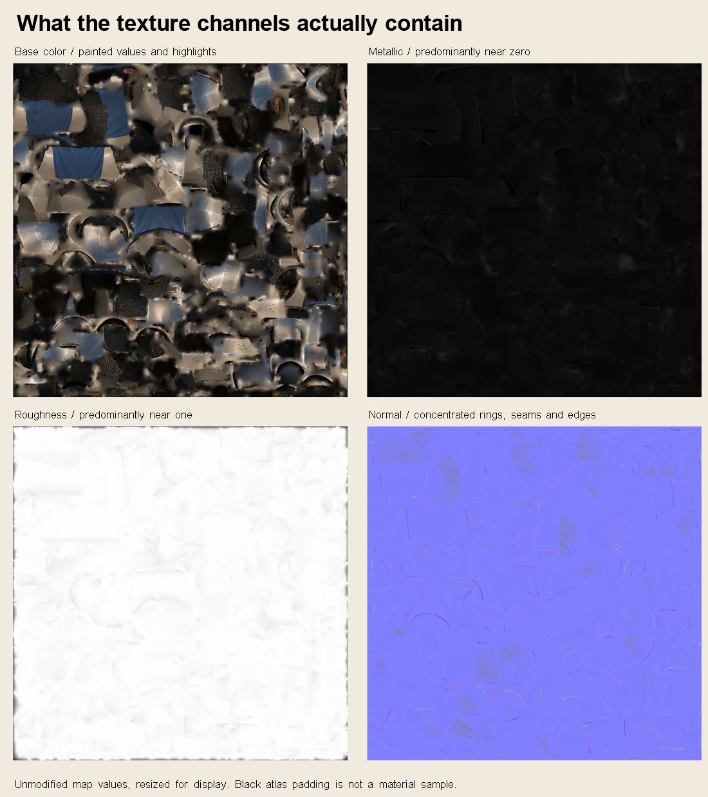
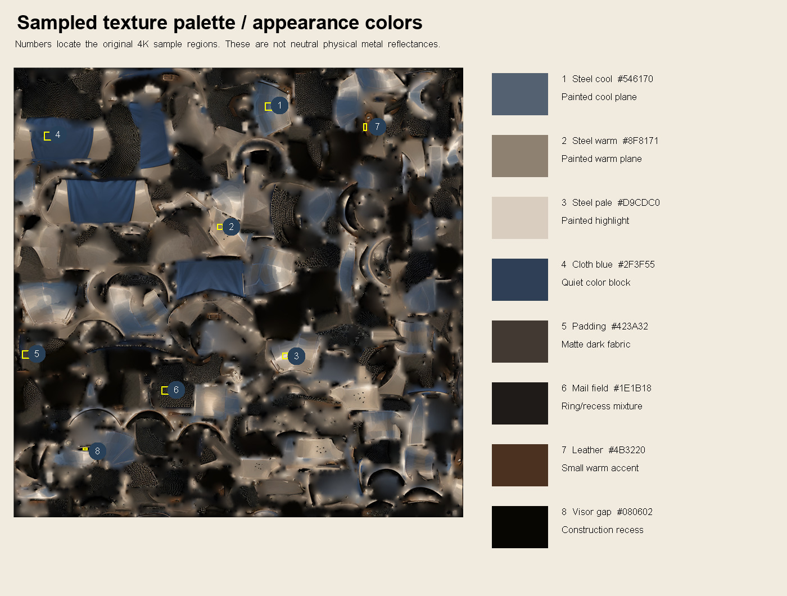
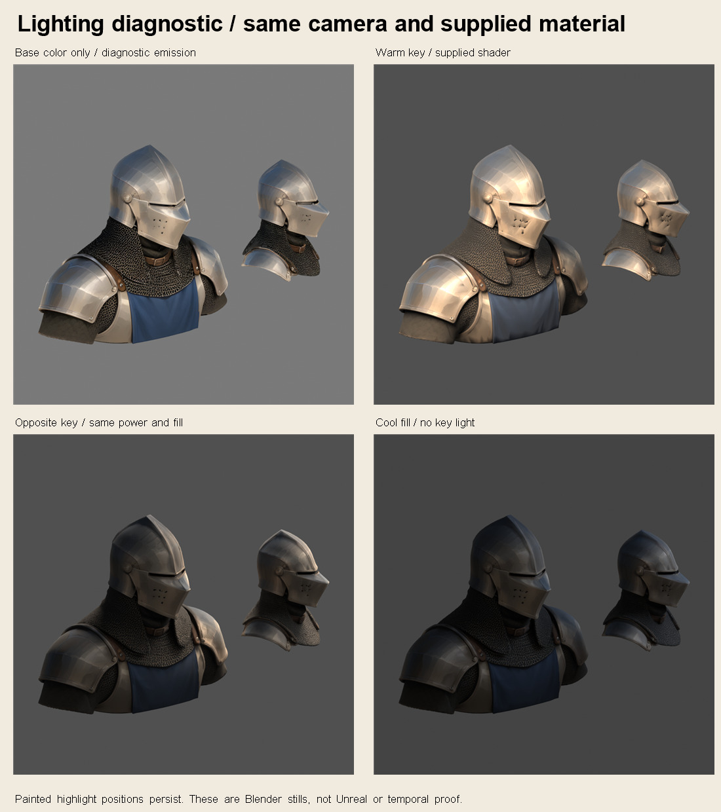
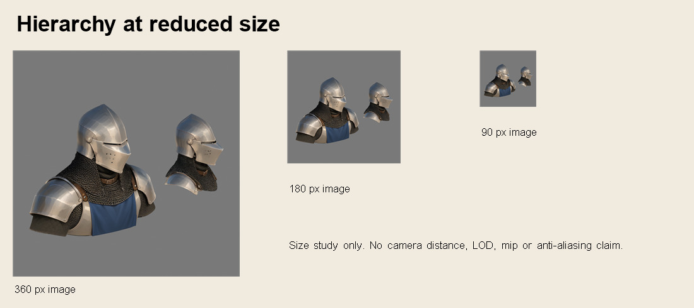

# Hound surface style guide

13 September 2026. Derived art direction and practical recipes for MeleeCombatLab. [Notion owns the design decision](https://app.notion.com/p/3d42e3c3f8f881abb5c1c356dc68ee07); the [source checkpoint](../../ArtSource/HunyuanHound/Hound_v001/CHECKPOINT.md) owns exact identities, inspection evidence and limitations.

**Our surface-style anchor is Daniel's Hunyuan model, `exemplar_style.fbx`, supported by `11-hound-bascinet.png`.** Daniel described its texture as exactly the desired game style, selected it as the primary authority over older steel studies, and requested whole-game translation. Preserve its appearance first. Earlier accepted geometry and Unreal material studies remain preserved benchmarks; they do not override this new surface direction. This approval concerns the exemplar's style, not a completed game implementation.

Working description: **painted medieval material realism**. Recognizable armor construction and rounded volume carry deliberately composed color, reflection and detail. The surfaces feel illustrated, substantial and tactile at once. This phrase is our shorthand, not a claim about Hunyuan's process or a named historical art movement.

## 1. What makes it work

| Visible technique | Why it is effective | Reproduction instruction |
|---|---|---|
| Broad cool/warm steel regions | Blue-gray upper regions and warm gray faces suggest sky and surroundings while retaining a coherent shell | Design a few large value/hue regions per plate before adding smaller patches; carry their flow around the form |
| Angular patches inside curved volumes | Hard and softly broken color boundaries make the metal feel deliberately illustrated; the silhouette still feels forged | Author irregular polygonal masks with unequal sizes and some softened boundaries. Let ridges redirect them; retain quiet areas |
| A hierarchy of highlights | Broad pale regions establish volume; thin rims and a few small fastener glints establish precision | Separate broad reflection shapes, structural rims and tiny accents into independent authoring groups |
| Deep, localized darks | The visor slit, plate overlaps and padded neck give the bright metal thickness and concentrate attention | Reserve the deepest values for meaningful gaps. Shape each recess instead of darkening every seam equally |
| Different detail scales by material | Dense mail feels intricate beside broad plate and cloth surfaces | Use repeated detail primarily on mail; give cloth larger folds, leather fewer seams, and steel calmer fields |
| Restrained chroma | Muted blue, warm brown and neutral steel coexist without competing | Use blue as a substantial grouping area and brown as a smaller connector; keep ivory highlights scarce |
| Sparse signs of manufacture and use | Rivets, rims, hinges and slight surface irregularity make the object tangible | Place wear at contact and construction features. Add subtle mottling after the main reading works |

These are observations and our interpretation of their visual effect. The generator's actual brushes, training sources, prompts and internal stages are unknown.

The generated model simplifies the illustration: its steel patches are broader and cleaner, mail reads more like a textured field, and cloth is smoother. **That simplification is part of the approved model's character.** Do not automatically restore every fleck, ring or fold from the concept. The source image's sharpness and rich small detail remain useful supporting references.

## 2. What is actually in the model

The imported FBX has 24,878 vertices, 50,004 triangles, one UV layer, one material, and both reference-sheet busts inside one mesh object. Four embedded 4096 x 4096 PNGs drive a Blender FBX-imported Principled material. The [manifest](../../ArtSource/HunyuanHound/Hound_v001/manifest.json) records their hashes, connections and inspection settings.

| Map | Observed contents | Interpretation and handling |
|---|---|---|
| Base color, sRGB | Steel color patches, pale highlights, dark recesses, cloth folds, mail pattern and fittings | It stores a substantial part of the final illustrated appearance, including lighting cues. It is not a clean, lighting-free material-color map |
| Metallic, linear data | UV-area 5th/median/95th percentiles: **0.031 / 0.043 / 0.063** | The supplied material behaves predominantly as a dielectric. The filename alone does not establish physically metallic steel |
| Roughness, linear data | UV-area 5th/median/95th percentiles: **0.957 / 0.988 / 0.996** | Dynamic specular response is very broad. Preserve this evidence rather than replacing it with an assumed steel roughness |
| Normal, linear data | Broad steel areas near flat tangent normal, concentrated ring/seam/edge detail | Much of the angular steel appearance is painted color; the normal map mainly supports localized relief |

Statistics use 564,038 covered UV samples on a 1024-square coverage grid, sampling the original 4K maps at cell centers. Atlas padding is excluded. They describe the whole mapped asset, not steel-only parameter prescriptions. The imported shader also has Specular IOR Level 1.0; that is an observed importer result, not a universal authoring default. Exact original Hunyuan viewer behavior is unavailable.

## 3. Our palette

These are **appearance swatches sampled from the supplied base-color PNG**, using per-channel upper medians of UV-covered pixels inside selected rectangles; padding is excluded. [Palette data](../../ArtSource/HunyuanHound/Hound_v001/palette.json) stores original-pixel rectangles, covered sample counts, RGB values and the method. They are practical anchors for paint layers and comparisons, not calibrated neutral reflectances or colors that must remain unchanged under every light.

| Token | sRGB hex | Role |
|---|---|---|
| Steel cool | `#546170` | Muted blue-gray plane and cool reflection family |
| Steel warm | `#8F8171` | Warm gray midtone and reflected environment family |
| Steel pale | `#D9CDC0` | Pale ivory reflection; stronger localized peaks may be brighter |
| Cloth blue | `#2F3F55` | Broad quiet heraldic grouping |
| Padding | `#423A32` | Warm charcoal fabric |
| Mail field | `#1E1B18` | Median of dark rings and recesses; not an individual ring highlight |
| Leather | `#4B3220` | Small warm brown material accents |
| Visor gap | `#080602` | Deep localized construction shadow sampled from the mapped slit |

Build ramps by varying value within each family and shifting warm/cool deliberately. Keep cloth saturation below the strongest highlight's attention. Match relationships before matching individual pixels.

For environments, retain warm limestone `#C9B892` and muted red `#813D36` as **earlier project tokens**, not new model measurements. Wood, foliage, terrain and additional heraldry require their own subordinate ramps. UI danger, stamina and parry semantics remain owned by the UI guide; these appearance colors do not replace them.

## 4. Reusable art tools and texture recipe

This is a recipe toolkit, not installed brush presets or generated production assets.

| Tool or operation | Role in our workflow | Concrete output |
|---|---|---|
| Hunyuan reference generation | Explore coherent material appearance from a clean single-subject reference | Retained input image, output model/maps and actual settings when available |
| Blender import, node inspection and fixed cameras | Separate shape, painted appearance and shader response | Native inspection scene, channel views, source-bound comparisons |
| Blender texture painting / existing layered image editor | Deliberately compose masks, paint and corrections | Separate images or layers for material blocks, broad patches, rims, recesses and fine detail; retain editable versions |
| Polygon selection / hard flat brush | Large steel color regions and selected patch edges | Unequal, form-following regions; low edge jitter |
| Soft brush / controlled gradient | Broad rounding, cloth fold transitions and selective edge softening | Smooth transitions inside the larger designed shapes |
| Small edge brush / masked fill | Rims, seams, fasteners and sparse wear | Narrow accents localized to construction |
| Low-opacity textured dab | Quiet surface grain and sparse mottling | Secondary texture that disappears before the major design when reduced |
| Tangent-normal and roughness authoring | Physical relief and eventual moving reflection design | Separate, clearly named data maps; correct color-space and normal convention |

Use image-per-layer sources when working in Blender without a layer-stack tool. Layer names describe intent: `MaterialBlocks`, `BroadColorPlanes`, `PaintedLightStudy`, `ConstructionRims`, `Recesses`, `FineMaterialDetail`. Preserve a flattened output separately. These are proposed organizational names, not Hunyuan's original layers.

1. **Block material and value groups.** Establish steel, blue cloth, padding, mail and brown fittings. Check silhouette and material grouping at reduced size.
2. **Compose broad planes.** On each major steel shell, start with roughly three to five unequal regions as a working exercise, not a measured exemplar count. Fit their orientation to the crown, shoulder dome or visor projection.
3. **Add a quieter second scale.** Break selected large regions with smaller angular shapes. Leave substantial uninterrupted areas; avoid a uniform cell size or equal contrast at every boundary.
4. **Separate reflection design from permanent color.** Preserve the approved painted appearance in `PaintedLightStudy`; keep its mask editable for a later relighting transfer. Do not permanently bake every attractive glint into the only color source.
5. **Resolve construction.** Add thin rims, the strongest recesses and localized fastener accents. Preserve genuine edge thickness in geometry where silhouette or overlap depends on it.
6. **Assign material-specific fine detail.** Mail gets organized rings; padding gets quilting; leather gets restrained seams; steel gets subtle grain. Preview normal detail at its intended screen size.
7. **Reduce and compare.** Inspect close detail and the same image at smaller sizes. Remove detail that competes with the visor, plate hierarchy or broad cloth block.
8. **Check lighting separately.** Keep camera, geometry, exposure and the comparator fixed while changing the light. Record whether the problem is permanent paint, geometry, a data map or lighting before editing.

### Material recipes

| Material | Base-color design | Relief and reflection design | Finish criterion |
|---|---|---|---|
| Steel | Cool/warm gray families, unequal angular regions, scarce ivory accents | Continuous plate curvature and selected ridges; localized edge relief. For a relightable variant, assign broad reflection patches to gentle tangent-normal changes and restrained roughness differences | Reads as one constructed plate with authored variation through both light and shade |
| Mail | Dark field with organized, muted lighter rings | Ring relief in tangent normals; silhouette geometry only where needed. Filter distant ring contrast | Reads as mail close up and a dark flexible material farther away |
| Cloth | Broad blue block, large folds, restrained woven variation | Matte response; normals support folds and a quiet weave | Main folds survive reduction while the weave recedes |
| Padding | Warm charcoal with a larger quilt rhythm than mail | Soft relief and broad matte response | Separates flexible gaps from hard armor without becoming a second focal pattern |
| Leather | Warm brown grouping with restrained seam and use-point accents | Modest broad sheen; buckle/rivet metal belongs to a separate material mask | Connects armor parts with legible construction and little visual noise |

No universal scratch density, brush opacity, metallic value or roughness number is established by these observations. Keep the supplied map values in the preserved comparator; tune new authoring against visible results.

### Prompt templates

For a new reference or texture candidate, replace the bracketed asset description and supply a crop containing **one intended object**:

> [Asset description] in the supplied Hound model's painted medieval material style. Natural construction and continuous rounded volumes. Broad, unequal angular steel color regions; muted slate-blue cool planes, warm gray midtones, localized ivory highlights; precise thin construction rims. Dark flexible mail and padding, quiet deep-blue cloth, small warm-brown leather fittings. Strong large-form and material hierarchy, localized fine detail, restrained grain. Preserve the reference's clean broad steel treatment and substantial material feel.

For a future relighting-oriented candidate, append:

> Keep broad surface color variation, but separate directional reflections and cast shadows from the material-color texture wherever the tool supports it. Supply independently usable base color, tangent-space normal, roughness and metallic maps. Preserve the distinctive reflection-shape design as a reference for material finishing.

A prompt is a request, not evidence that the output separates lighting correctly. Inspect actual maps. Use a brief correction clause for an observed defect, such as “reduce the count of small steel patches; preserve the large pale region and thin rim.” Avoid lengthy negative-prompt lists that obscure the desired construction.

## 5. Reconstructing it in a game with changing lighting

**Yes: the style can be reconstructed with dynamic lighting.** The distinctive patch shapes, hue relationships, controlled edge hierarchy and material contrast are transferable. Fidelity on this exact model has not yet been demonstrated in Unreal.

The base-color-only view retains the crown's pale region, shoulder highlights and dark mail. With the key moved behind the model, illumination changes and the front darkens, while those painted shapes persist. The cool-fill view keeps their locations too. These observations establish a baked-lighting contribution; they do not prove that every patch is an unwanted reflection.

| Route | Preserve | Change | Appropriate use |
|---|---|---|---|
| Supplied appearance comparator | Original mesh/maps and broad painted shading | Only controlled inspection lighting | The immutable visual benchmark and initial appearance reference |
| Recommended future game material | Palette relationships, patch silhouettes, quiet detail, rims, construction and overall illustrated character | Selectively soften strong directional baked highlights/shadows; reconstruct moving reflections with normal/roughness design | An isolated production-feasibility proof under changing light |

For that future proof, use one helmet/shoulder surface and keep the original beside it. Manually separate metal from cloth, leather, padding and holes; texture brightness is not a reliable metallic classifier. Preserve low-contrast color patches in base color. Repaint only the strongest baked illumination into a plausible underlying color, retaining the original as a locked layer. One lit texture does not uniquely determine its original albedo, normals and lighting; treat this as guided reconstruction.

Recreate the desired broad reflection boundaries through an authored normal field that respects the plate's continuous construction normals, plus a few broad roughness regions. Blend gently and normalize tangent-space normals. Shape the reflection response without imposing a visibly triangulated silhouette or tiny normal discontinuities. Keep curvature, edge thickness and physical overlap in their correct geometry/normal roles.

Use Unreal's existing lit material system first. Base color carries permanent color; Metallic separates metal/dielectric response; Roughness controls reflection breadth; Normal controls local orientation. Genuine bare-steel masks can use a metallic endpoint in the reconstructed variant, with a moderately broad reflection response, then be tuned against the comparator. This is **not** authorization to set the original atlas globally metallic or to adopt the older study's values. Epic documents these inputs in its [physically based material guide](https://dev.epicgames.com/documentation/unreal-engine/physically-based-materials-in-unreal-engine). The authored hybrid proposed here is an artistic inference from our inspection, not an Epic recipe.

Preserve some broad painted form shading where it supports the style. Let the engine supply directional illumination, contact shadows and the strongest moving highlights. The diagnostic emission view is solely an inspection tool. Avoid using emission to hold the entire asset at its daylight brightness in darkness. Review exposure and lighting only after the material is coherent; postprocessing cannot separate baked highlights from color.

The smallest useful future acceptance comparison is a fixed camera with the key on opposite sides, a shaded/fill condition, then a moving light and rotating view at unchanged exposure. Verify that reflections move, painted pattern remains stable, the metal retains its illustrated identity, and cloth/mail stay subordinate. Finish with game-distance mip/AA checks. Use an isolated Unreal asset and the existing transfer route; no new renderer or global shader stack is currently justified. This documentation task performs the Blender still diagnostics only.

## 6. Whole-game translation

These applications are **design extrapolations**, not measured materials or accepted environment assets.

| Surface or context | Transfer the principle | Practical application |
|---|---|---|
| Stone and masonry | Large quiet forms, warm/cool organization, precise structural edges | Warm block faces, cooler shade, controlled bevel accents, sparse large chips; keep micro-pitting below actor detail |
| Wood | Form-following direction and limited accent density | Broad grain groups following boards; selective joints/end grain and wear; fewer equally dark grain lines |
| Terrain | Material blocks and selective detail | Compose soil, grass and stone as larger masses before scattering small variation; keep duel space readable |
| Foliage | Unequal grouped shapes and restrained chroma | Leaf/branch clusters with readable light/shade masses; avoid uniformly bright individual leaves |
| Architecture | Construction hierarchy and distinctive silhouettes | Strong rooflines, openings and overlaps; economical trim and localized wear |
| Weapons | Precise edges and material contrast | Broad blade reflection structure, narrow bevel glints, quiet dark grip; preserve gameplay contact dimensions |
| UI and effects | Clear value hierarchy and restrained accents | Carry selected palette relationships into existing semantics; effects remain brief and subordinate to combat |

## 7. Failure examples and review

| Visible failure | Concrete example | First correction |
|---|---|---|
| Uniform patch noise | Crown, visor and shoulder all covered with equally small, equally bright cells | Merge most cells into larger quiet regions and keep only selected interruptions |
| Overdrawn wear | Every edge is a thick white stripe and every face is scratched | Narrow construction accents and remove wear from unused areas |
| Competing material detail | Mail rings sparkle more brightly than the helmet's focal reflection | Lower ring highlight contrast and improve distant filtering |
| Lost cloth hierarchy | Fine weave and small folds break the blue into visual noise | Restore a broad blue field and a few major fold transitions |
| Plastic or generic chrome | Relighting removes the authored patches, or produces mirror streaks everywhere | Restore reflection-shape design and broaden selected reflection regions; compare under the same light |
| Fixed painted lighting becomes obvious | A white crown patch stays dominant while the light moves behind the helmet | Separate that directional highlight from permanent color and reconstruct its response |
| Poor view consistency | Rear texture smears or small-bust reconstruction is treated as an approved character | Keep this source as style evidence; resolve asset-specific topology and unseen design separately |

Inspection finds softened or distorted breathing holes, simplified rings, and unevenly resolved rear detail. Both busts were reconstructed from the sheet; no rig or usable full-body topology is established. These are source limitations, not reasons to discard its approved texture language.

Review each new asset for silhouette, material separation, broad patch organization, restrained edges, color relationships and distance hierarchy. Named views must be bound to its exact source. Inspect complete source-timed motion when animation changes. The size sheet above is image reduction, not a tested gameplay distance, LOD, mip chain or anti-aliasing result.

Human approval of the exemplar is established by Daniel's request. The guide's extrapolations, reconstructed material, temporal stability, Unreal transfer and 100–144 FPS target remain unproven. Do not attach new visual scores to those missing results.
