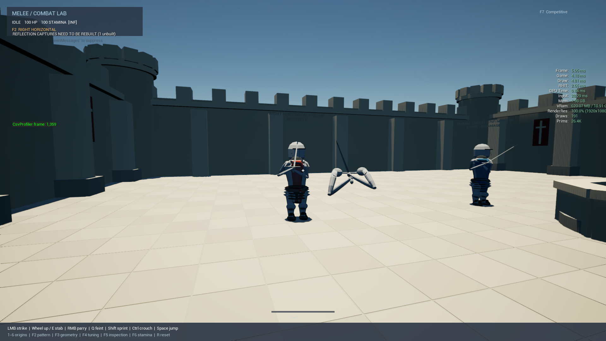
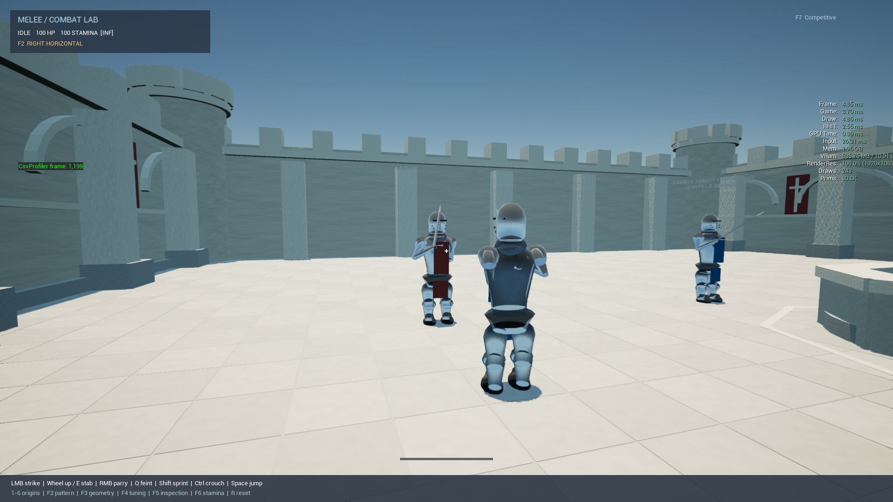
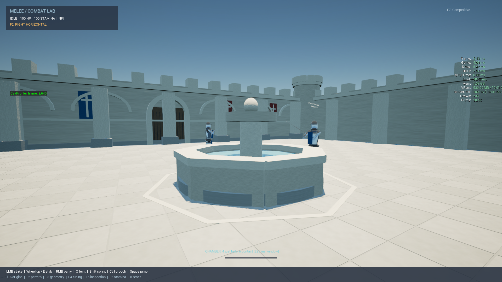

# Aesthetic rehaul — September 6, 2026

## Audit of the current checkout

The handoff was reviewed against `909cf64`, not the older documentation. The
latest request freezes combat and supersedes PROJECT_SPEC's original gray-box
art priorities. No source under Combat or Movement, timing defaults, input
mapping, or collision shapes are changed by this pass.

| System | Existing state | Decision |
|---|---|---|
| Simulation/presentation boundary | Fixed-step simulation supplies actual hilt/tip. Seven-part trajectory already implements anticipation, hilt drive, blade direction, body motion, front-loaded release, follow-through and recovery. | Keep. Changing release acceleration or hilt travel here would change combat, even if described as animation polish. |
| WeaponPresentationComponent | Decorative endpoint lag outside release; blade used a different roll frame than guard; rough equal-link arms; camera-pitched shoulders. | Replace pose calculation with a shared read-only adapter. |
| KnightPresentation | Rounded lathed pieces, oversized helmet, stacked skirt, reaction-only chest; only dummies had bodies. | Keep as an asset-free fallback and inspection fixture, not the final character model. Replace mesh/rig backend when authored assets are available. |
| TournamentAssets | Shared transient two-LOD geometry. Flat face normals, inside-out blade triangles, collapsed longitudinal UVs. | Repair and extend the fallback. It is useful infrastructure, not hero-quality art. |
| Materials | Generator and source textures committed; generated material/texture assets absent. Runtime silently used BasicShapeMaterial. | Generate and include the shared library. |
| Courtyard | Instanced perimeter, paving, arch gates, heraldry and colliding octagonal basin already implemented. | Extend composition; preserve all existing collision and lanes. |
| Lighting | Stable exposure, one sun, skylight; runtime reflection capture had no built cubemap and emitted a warning. | Use atmosphere skylight capture for diffuse fill and reflections. |
| Profiles/benchmark | Competitive, High, Showcase and six-second warmup/24-second route implemented. Historical docs incorrectly called most work planned. | Reuse unchanged route and report local measurements honestly. |

The durable parts are the simulation boundary, instancing, shared asset factory,
graphics tiers and repeatable fixtures. None of the procedural knight anatomy,
hands, authored motion, materials or runtime environment is production-certified.

## Highest-leverage implementation

`Visual/MeleePresentationPose.h` is a portable, stateless presentation adapter.
Its input is const combat state; its output is exact blade endpoints, an
orthonormal sword frame, body motion and two world-space shoulder/elbow/hand
targets. Both procedural weapon/arms and body presentation consume it.

The sword is the constraint. Arms follow its two grip contacts. The torso shows
directional loading and follow-through. A future AnimBP/Control Rig consumes
these targets after locomotion and authored upper-body poses, with final hand IK
last. Neither animation notifies, skeletal sockets nor root motion supply damage
or weapon collision. Gold parry and cyan chamber feedback remain distinct.

The current adapter retains existing body curves rather than secretly retiming
the simulation. It fixes a concrete presentation discontinuity: camera-right is
transported to the blade frame so vertical/lateral cuts do not flip the edge.
Blade, guard, grip and gauntlets share that frame. The visible blade no longer
adds non-release positional lag. Its original winding was reversed and is fixed.

The two-link solve preserves grip contacts and reports `reachScale`. The frozen
trajectory exceeds normal reach at some extreme pitches: the fallback explicitly
stretches its cosmetic links rather than moving the weapon or pretending this is
an anatomically final rig. Coincident and pole-parallel targets remain finite.

## Staged delivery

1. **Presentation foundation — implemented.** Shared pose adapter, exact blade
   alignment, stable sword roll, yaw-anchored shoulders, tested two-link arms,
   revised gauntlet/pauldron/guard/pommel silhouettes and corrected mesh normals.
2. **Character architecture — first increment implemented.** All characters now
   own the same body component; local torso/head are hidden in first person and
   shown in F5/benchmark views. Torso reads attack motion. Helmet and skirt
   proportions are reduced. Next: authored rigged knight and weighted hands,
   clavicles, spine twist and grounded locomotion. Procedural death/crouch and
   disconnected joints at extreme poses still require a real rig.
3. **Courtyard — first increment implemented.** Keep current foundation, gate,
   basin and perimeter. Add shallow gallery arches, string courses, plinths and
   a paving inlay framing the fountain. No new colliders. Next: an authored
   stone trim sheet, recessed arcade modules and shaped hanging banners; put
   richness above the combatant silhouette band and around the perimeter.
4. **Materials/light — first increment implemented.** Generated shared assets
   now supply steel/leather/cloth/stone response and animated opaque water.
   Smooth armor shading, longitudinal equipment UVs and atmosphere skylight
   reflections replace the flat fallback. Next: artist-authored trim/normal
   textures, better baked environment reflection strategy and water geometry.
5. **Validation/performance — recorded below and in VALIDATION.** Same route at
   each graphics tier, rendered combat fixture, ASan presentation checks and
   Unreal automation. Profile before adding further component-heavy details.
   Packaged and target-tier hardware checks remain outstanding.
   The first capture exposed redundant recursive body visibility updates;
   those now run only on a camera visibility transition, avoiding per-frame
   render-state rebuilds.

## First-person and imported-asset contract

Use matching armored arms/hands with a separate owner-hidden head/torso.
Keep the weapon in world space with the authoritative hilt and tip; do not use a
second FOV or camera-relative weapon offset that misrepresents reach. F5 shows
the full body. A future torso look-down pass needs a separate camera-safe mesh,
not a scaled full-body head inside the camera.

Missing assets: licensed/original knight skeletal mesh with LODs, weighted
gauntlets/fingers, spine/clavicle/arm chains, authored locomotion and phase poses,
hand grip calibration and armor/cloth trim textures. No rig or animation pack is
claimed to have been imported. The current C++ targets are the integration seam;
an AnimBP or Control Rig asset has not yet been built.

Procedural equipment uses a 100-unit length along local X, centered at zero.
Blade hilt/tip are X=-50/+50, edge is local Y and thickness local Z. Imported
static replacements must be normalized or given an explicit calibration adapter.
Imported skeletal rigs must convert world targets to component space, preserve
the sword frame and solve hands last. Armor and cloth collision stays disabled.

Generate materials using `Tools/BuildMaterials.py` in Unreal's Python commandlet;
source textures are under ArtSource/Textures. Generated assets are included
under Content/Visual and explicitly included in cooking. The environment and
character materials share the existing compact library, with no downloaded art.

## Verification and limitations

Native baseline before edits fails after 557 checks on the stationary
double-parry constraint: second-parry-ready=0.915 s; second-threat=0.950 s.
This pass does not alter that test or the frozen timings to force a green result.
The older documentation's 461-pass claim describes a previous revision.

Run `Tools/TestCore.ps1 -Sanitize -PresentationOnly` for the independent pose
suite. It covers all six strike origins and stabs at 30/60/144/240 Hz and
-85/0/+85 degree pitch, exact blade/grip contacts, limb lengths, finite degenerate
targets, fixed shoulder anchors and sword-frame continuity. Repeated sampled
assertions are not distinct gameplay scenarios.

Visual captures and measured results are appended to STYLE_AND_PERFORMANCE.md.
The current art is an improved procedural fallback, not a completed premium
skeletal character or a substitute for human swing-feel review.

## Review captures

Before and after use the same Competitive route/camera. The after view now
includes the player's external body, which was absent in the original capture.

| Before | After |
|---|---|
|  |  |

[First-person parry capture](Captures/first-person-parry.png) shows the shared
sword/hand frame and material response before the final cloth and ambient-fill
adjustment. Captures establish the current fallback quality; they do not claim
final authored knight or finger animation quality.

Measured final local means: Competitive 170.8 FPS, High 161.7 FPS, Showcase 163.3 FPS. See [STYLE_AND_PERFORMANCE.md](STYLE_AND_PERFORMANCE.md) for frame times, limitations and raw-data locations. Build and Unreal automation pass; the full rendered tour is 34/38 and the pre-existing native double-parry assertion remains failing.
